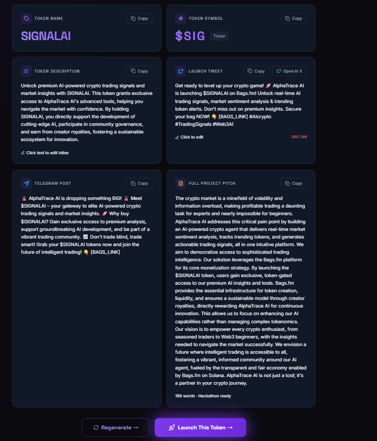
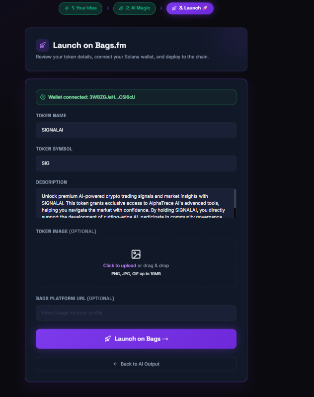
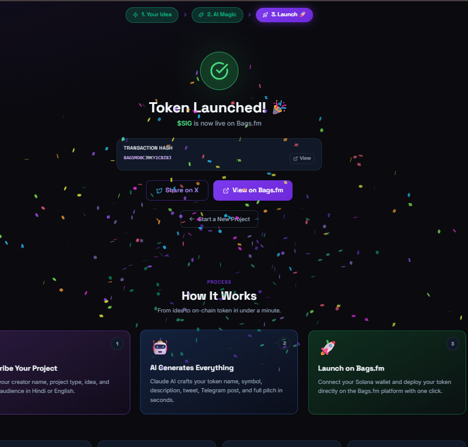

# 💼 BagsLaunchKit

### AI-Powered Creator Token Launch on Bags.fm in Under 60 Seconds 🚀

**Bags.fm • Solana • Gemini AI**

[🌐 Live App](https://bagslaunchkit.vercel.app/) • [📹 Demo Video](#) • [🐦 Twitter](https://twitter.com/YousufAziz1)

---

## 🚨 The Problem

Most creators (YouTubers, musicians, writers) are not crypto experts or marketers.

If they want to launch a token on Bags.fm, they face:

* ❌ What should the token name be?
* ❌ How to write description & narrative?
* ❌ How to create hype (Tweets / Telegram)?
* ❌ How to go from idea → launch?

👉 Result: **Most creators never launch**

---

## ✨ The Solution

**BagsLaunchKit = AI Copilot for Token Launch**

👉 Idea → AI → Token → Launch

It automatically generates:

* 🪙 Token Name & Symbol
* 📝 Description & Narrative
* 🐦 Viral Tweets
* 📢 Telegram Announcements
* 📄 Full Project Pitch

🚀 Reduces token launch time from **hours → under 60 seconds**

---

## ⚡ How It Works

### 1️⃣ Input

User enters idea (Hindi / English)

### 2️⃣ AI Magic

Gemini AI generates full launch kit

### 3️⃣ Launch

User connects wallet → launches token

---

## 📹 Demo Video

👉 [Add your YouTube video link here]

---

## 🖼️ Screenshots

|             Idea Input            |             AI Output             |               Launch              |
| :-------------------------------: | :-------------------------------: | :-------------------------------: |
|  |  |  |

---

## 🔗 Bags.fm Integration

* Uses `@bagsfm/bags-sdk` for token launch
* Wallet connect via Solana adapter
* AI-generated metadata directly used
* Designed for creator monetization

---

## ⚠️ Simulation Mode

This project currently runs in **Simulation Mode**

👉 No real blockchain transaction is executed
👉 Built for demo & hackathon presentation

(Real launch possible with API key + RPC)

---

## 🛠️ Tech Stack

* Frontend: React + Vite + Tailwind
* Backend: Node.js / Serverless
* AI: Gemini API
* Blockchain: Solana
* Integration: Bags SDK

---

## 🏆 Hackathon Submission

| Field    | Details                                      |
| -------- | -------------------------------------------- |
| Builder  | Yousuf Aziz                                  |
| Track    | Creator Tools                                |
| Live App | https://bagslaunchkit.vercel.app             |
| GitHub   | https://github.com/YousufAziz1/bagslaunchkit |
| X        | https://twitter.com/YousufAziz1              |

---

## 💡 Why This Matters

👉 Creator economy + AI + Crypto = Future

BagsLaunchKit enables anyone to become a **crypto founder in 60 seconds**

---

## 🔮 Future Plans

* Real Mainnet Launch
* AI Growth Automation
* Creator Dashboard
* Token Analytics

---

## 🤝 Contributing

1. Fork the repo
2. Create branch
3. Make changes
4. Submit PR

---

## 📄 License

MIT License

---

Built with ❤️ for Bags.fm Hackathon
by Yousuf Aziz

⭐ Star this repo if you like it!

